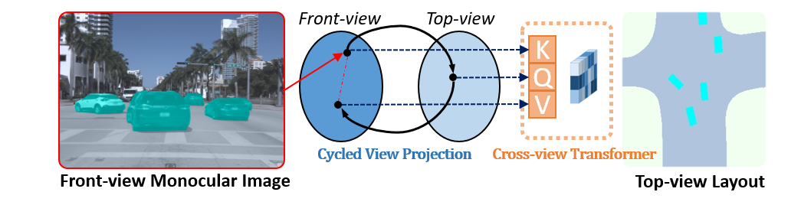
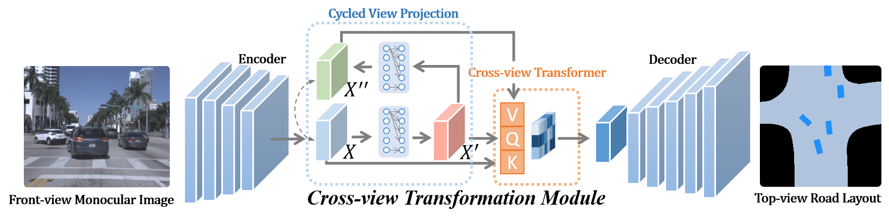
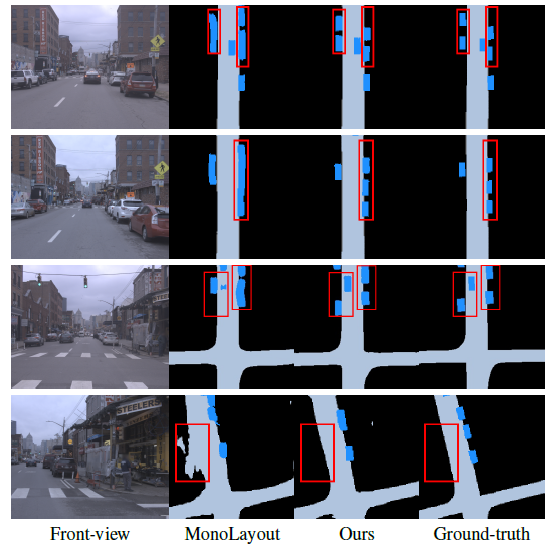

# Projecting Your View Attentively: Monocular Road Scene Layout Estimation via Cross-view Transformation
#### Weixiang Yang, Qi Li, Wenxi Liu, Yuanlong Yu, Yuexin Ma, Shengfeng He, Jia Pan

#### [Paper](https://openaccess.thecvf.com/content/CVPR2021/papers/Yang_Projecting_Your_View_Attentively_Monocular_Road_Scene_Layout_Estimation_via_CVPR_2021_paper.pdf)

#### Accepted to CVPR 2021



## Abstract

HD map reconstruction is crucial for autonomous driving. LiDAR-based methods are limited due to the deployed expensive sensors and time-consuming computation. Camera-based methods usually need to separately perform road segmentation and view transformation, which often causes distortion and the absence of content.  To push the limits of the technology, we present a novel framework that enables reconstructing a local map formed by road layout and vehicle occupancy in the bird's-eye view given a front-view monocular image only.  In particular, we propose a cross-view transformation module, which takes the constraint of cycle consistency between views into account and makes full use of their correlation to strengthen the view transformation and scene understanding. Considering the relationship between vehicles and roads, we also design a context-aware discriminator to further refine the results. Experiments on public benchmarks show that our method achieves the state-of-the-art performance in the tasks of road layout estimation and vehicle occupancy estimation. Especially for the latter task, our model outperforms all competitors by a large margin. Furthermore, our model runs at 35 FPS on a single GPU, which is efficient and applicable for real-time panorama HD map reconstruction.

## Contributions

* We propose a novel framework that reconstructs a local map formed by top-view road scene layout and vehicle occupancy using a single monocular front-view image only. In particular, we propose a cross-view transformation module which leverages the cycle consistency between views and their correlation to strengthen the view transformation.
* We also propose a context-aware discriminator that considers the spatial relationship between vehicles and roads in the task of estimating vehicle occupancies.
* On public benchmarks, it is demonstrated that our model achieves the state-of-the-art performance for the tasks of road layout and vehicle occupancy estimation.
## Approach overview



## Repository Structure

```plain
cross-view/
├── crossView            # Contains scripts for dataloaders and network/model architecture
└── datasets             # Contains datasets
    ├── argoverse        # argoverse dataset
    ├── kitti            # kitti dataset 
├── log                  # Contains a log of network/model
├── losses               # Contains scripts for loss of network/model
├── models               # Contains the saved model of the network/model
├── output               # Contains output of network/model
└── splits
    ├── 3Dobject         # Training and testing splits for KITTI 3DObject Detection dataset 
    ├── argo             # Training and testing splits for Argoverse Tracking v1.0 dataset
    ├── odometry         # Training and testing splits for KITTI Odometry dataset
    └── raw              # Training and testing splits for KITTI RAW dataset(based on Schulter et. al.)
```
## Installation

We recommend setting up a Python 3.7 and Pytorch 1.0 Virtual Environment and installing all the dependencies listed in the requirements file.

```plain
git clone https://github.com/JonDoe-297/cross-view.git

cd cross-view
pip install -r requirements.txt
```
## Datasets

In the paper, we've presented results for KITTI 3D Object, KITTI Odometry, KITTI RAW, and Argoverse 3D Tracking v1.0 datasets. For comparison with [Schulter et. al.](https://cseweb.ucsd.edu/~mkchandraker/pdf/eccv18_occlusionreasoning.pdf?fileGuid=3X8QJDGGJPXyQgW9), We've used the same training and test splits sequences from the KITTI RAW dataset. For more details about the training/testing splits one can look at the `splits` directory. And you can download Ground-truth from [Monolayout](https://github.com/hbutsuak95/monolayout?fileGuid=3X8QJDGGJPXyQgW9).

```plain
# Download KITTI RAW
./data/download_datasets.sh raw

# Download KITTI 3D Object
./data/download_datasets.sh object

# Download KITTI Odometry
./data/download_datasets.sh odometry

# Download Argoverse Tracking v1.0
./data/download_datasets.sh argoverse
```
The above scripts will download, unzip and store the respective datasets in the `datasets` directory.
```plain
datasets/
└── argoverse                          # argoverse dataset
    └── argoverse-tracking
        └── train1
            └── 1d676737-4110-3f7e-bec0-0c90f74c248f
                ├── car_bev_gt         # Vehicle GT
                ├── road_gt            # Road GT
                ├── stereo_front_left  # RGB image
└── kitti                              # kitti dataset 
    └── object                         # kitti 3D Object dataset 
        └── training
            ├── image_2                # RGB image
            ├── vehicle_256            # Vehicle GT
    ├── odometry                       # kitti odometry dataset 
        └── 00
            ├── image_2                # RGB image
            ├── road_dense128  # Road GT
    ├── raw                            # kitti raw dataset 
        └── 2011_09_26
            └── 2011_09_26_drive_0001_sync
                ├── image_2            # RGB image
                ├── road_dense128      # Road GT
```
## Training

1. Prepare the corresponding dataset
2. Run training
```plain
# Corss view Road (KITTI Odometry)
python3 train.py --type static --split odometry --data_path ./datasets/odometry/ --model_name <Model Name with specifications>

# Corss view Vehicle (KITTI 3D Object)
python3 train.py --type dynamic --split 3Dobject --data_path ./datasets/kitti/object/training --model_name <Model Name with specifications>

# Corss view Road (KITTI RAW)
python3 train.py --type static --split raw --data_path ./datasets/kitti/raw/  --model_name <Model Name with specifications>

# Corss view Vehicle (Argoverse Tracking v1.0)
python3 train.py --type dynamic --split argo --data_path ./datasets/argoverse/ --model_name <Model Name with specifications>

# Corss view Road (Argoverse Tracking v1.0)
python3 train.py --type static --split argo --data_path ./datasets/argoverse/ --model_name <Model Name with specifications>
```
3. The training model are in "models" (default: ./models)
## Testing

1. Download pre-trained models
2. Run testing
```plain
python3 test.py --type <static/dynamic> --model_path <path to the model directory> --image_path <path to the image directory>  --out_dir <path to the output directory> 
```
4. The results are in "output" (default: ./output)
## Evaluation

1. Prepare the corresponding dataset
2. Download pre-trained models
3. Run evaluation
```plain
# Evaluate on KITTI Odometry 
python3 eval.py --type static --split odometry --model_path <path to the model directory> --data_path ./datasets/odometry --height 512 --width 512 --occ_map_size 128

# Evaluate on KITTI 3D Object
python3 eval.py --type dynamic --split 3Dobject --model_path <path to the model directory> --data_path ./datasets/kitti/object/training

# Evaluate on KITTI RAW
python3 eval.py --type static --split raw --model_path <path to the model directory> --data_path ./datasets/kitti/raw/

# Evaluate on Argoverse Tracking v1.0 (Road)
python3 eval.py --type static --split argo --model_path <path to the model directory> --data_path ./datasets/kitti/argoverse/

# Evaluate on Argoverse Tracking v1.0 (Vehicle)
python3 eval.py --type dynamic --split argo --model_path <path to the model directory> --data_path ./datasets/kitti/argoverse
```
4. The results are in "output" (default: ./output)
## Pretrained Models

The following table provides links to the [pre-trained models](https://drive.google.com/drive/folders/1PK9yiKdsXmoH53xP-As0h5n0LyBSgTGN?usp=sharing&fileGuid=3X8QJDGGJPXyQgW9) for each dataset mentioned in our paper. The table also shows the corresponding evaluation results for these models.

| Dataset            | Segmentation Objects | mIOU(%) | mAP(%)| Pretrained Model                                                                                                       | 
| :--------:           | :-----:     | :----:   | :----: | :----:                                                                                                                 |
| KITTI 3D Object     | Vehicle    |  38.85  | 51.04 | [link](https://drive.google.com/drive/folders/1XipKf-fLdpikyuQrSjWVrI_TIiZFy7HO?usp=sharing&fileGuid=3X8QJDGGJPXyQgW9) |
| KITTI Odometry     | Road     |  77.47  | 86.39 | [link](https://drive.google.com/drive/folders/1eQmDOvI6_iWKRaILAJ2XMA-GmlyjkgX1?usp=sharing&fileGuid=3X8QJDGGJPXyQgW9) |
| KITTI Raw          | Road     |  68.26  | 79.65 | [link](https://drive.google.com/drive/folders/1VuwZtN9IPtKIAya9N_33WWVMfW8HOzu5?usp=sharing&fileGuid=3X8QJDGGJPXyQgW9) |
| Argoverse Tracking | Vehicle    |  47.87  | 62.69 | [link](https://drive.google.com/drive/folders/1SFIwQ94IFc1Rg4SxUsGNabp4jDUPCSot?usp=sharing&fileGuid=3X8QJDGGJPXyQgW9) |
| Argoverse Tracking | Road    |  76.56  | 87.30 | [link](https://drive.google.com/drive/folders/1w5aTi0XQYbg3myWlmy89knA0gtp6fced?usp=sharing&fileGuid=3X8QJDGGJPXyQgW9) |

## Results


## Contact
If you meet any problems, please describe them in issues or contact:
* Weixiang Yang: [weixiang_yang@foxmail.com](weixiang_yang@foxmail.com)

## License
This project is released under the MIT License (refer to the LICENSE file for details).This project partially depends on the sources of [Monolayout](https://github.com/hbutsuak95/monolayout)